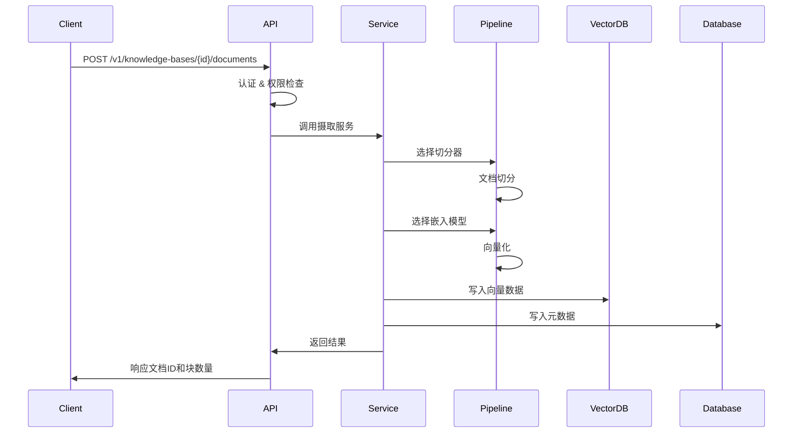
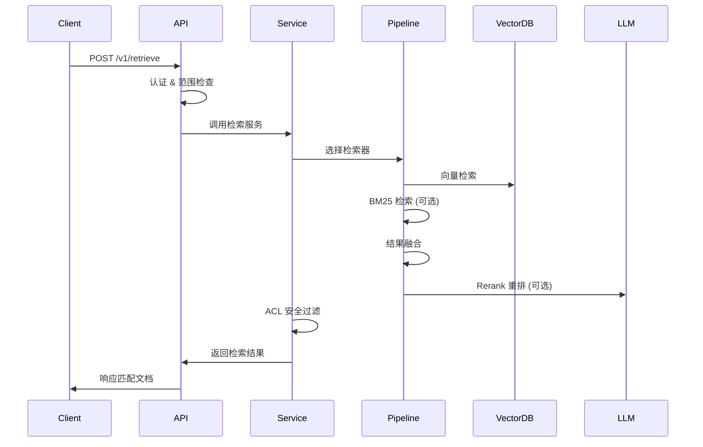
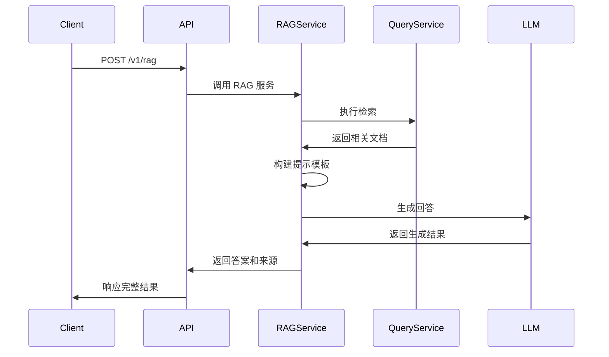

# 系统架构设计

本文档概述 Self-RAG Pipeline 的系统架构，包括核心组件、关键流程、多租户设计和扩展点。

## 架构概览

Self-RAG Pipeline 是一个多租户知识库检索服务，采用分层架构设计，提供 OpenAI 兼容的 API 接口和完整的 Python SDK。

### 核心组件

```
┌─────────────────────────────────────────────────────────────┐
│                        API 层                                │
│  FastAPI + OpenAPI + 认证中间件 + 限流 + 审计日志            │
└─────────────────────────────────────────────────────────────┘
                                │
┌─────────────────────────────────────────────────────────────┐
│                       服务层                                 │
│  摄取服务 │ 检索服务 │ RAG服务 │ ACL服务 │ 租户管理           │
└─────────────────────────────────────────────────────────────┘
                                │
┌─────────────────────────────────────────────────────────────┐
│                    Pipeline 算法层                           │
│  切分器 │ 检索器 │ 查询变换 │ 增强器 │ 后处理器 │ 索引器      │
└─────────────────────────────────────────────────────────────┘
                                │
┌─────────────────────────────────────────────────────────────┐
│                     基础设施层                               │
│  LLM客户端 │ 向量存储 │ BM25存储 │ 嵌入服务 │ 重排服务        │
└─────────────────────────────────────────────────────────────┘
                                │
┌─────────────────────────────────────────────────────────────┐
│                     数据访问层                               │
│  PostgreSQL │ Qdrant │ Redis │ SQLAlchemy │ Alembic         │
└─────────────────────────────────────────────────────────────┘
```

### 组件详细说明

#### API 层 (`app/main.py` + `app/api/routes/*`)
- **FastAPI 应用**：提供 RESTful API 和 OpenAI 兼容接口
- **认证中间件**：API Key 验证、角色权限控制、租户状态检查
- **限流机制**：基于 Redis 的分布式限流，支持按 API Key 独立配置
- **审计日志**：自动记录关键操作，支持合规审计
- **请求追踪**：X-Request-ID 全链路追踪

#### 服务层 (`app/services/*`)
- **摄取服务** (`ingestion.py`)：文档切分、向量化、索引构建
- **检索服务** (`query.py`)：多策略检索、结果融合、ACL 过滤
- **RAG 服务** (`rag.py`)：检索增强生成、上下文组装、LLM 调用
- **ACL 服务** (`acl.py`)：访问控制列表、安全修整、权限校验
- **租户管理**：多租户隔离、配额管理、状态控制

#### Pipeline 算法层 (`app/pipeline/*`)
- **可插拔架构**：通过 `operator_registry` 注册和发现算法组件
- **标准化接口**：统一的协议定义，确保组件间兼容性
- **动态配置**：支持运行时切换算法和参数调整
- **扩展性**：便于添加新的算法实现

#### 基础设施层 (`app/infra/*`)
- **多模型支持**：LLM、Embedding、Rerank 多提供商适配
- **向量存储**：Qdrant 主存储，支持 Milvus、Elasticsearch
- **稀疏检索**：BM25 内存存储，可选 Elasticsearch 后端
- **缓存层**：Redis 缓存热点数据，提升响应性能

#### 数据访问层 (`app/db/*` + `app/models/*`)
- **关系数据库**：PostgreSQL 存储元数据、用户数据、审计日志
- **ORM 框架**：SQLAlchemy 2.0 异步 ORM，支持连接池
- **数据库迁移**：Alembic 版本控制，支持升级和回滚
- **数据模型**：租户、知识库、文档、块、API Key 等核心实体

## 运行拓扑

### 部署架构

```
┌─────────────────┐    ┌─────────────────┐    ┌─────────────────┐
│   Load Balancer │    │   API Gateway   │    │   Web Frontend  │
│    (Nginx)      │    │   (Optional)    │    │   (Next.js)     │
└─────────────────┘    └─────────────────┘    └─────────────────┘
         │                       │                       │
         └───────────────────────┼───────────────────────┘
                                 │
┌─────────────────────────────────────────────────────────────┐
│                    API 服务集群                              │
│  ┌─────────────┐  ┌─────────────┐  ┌─────────────┐         │
│  │ API Server  │  │ API Server  │  │ API Server  │         │
│  │ (FastAPI)   │  │ (FastAPI)   │  │ (FastAPI)   │         │
│  └─────────────┘  └─────────────┘  └─────────────┘         │
└─────────────────────────────────────────────────────────────┘
         │                       │                       │
         └───────────────────────┼───────────────────────┘
                                 │
┌─────────────────────────────────────────────────────────────┐
│                      数据层                                  │
│  ┌─────────────┐  ┌─────────────┐  ┌─────────────┐         │
│  │ PostgreSQL  │  │   Qdrant    │  │    Redis    │         │
│  │ (元数据)     │  │  (向量)     │  │  (缓存)     │         │
│  └─────────────┘  └─────────────┘  └─────────────┘         │
└─────────────────────────────────────────────────────────────┘
```

### 网络通信

- **API 服务端口**：8020（HTTP）
- **PostgreSQL 端口**：5432（内部）/ 5435（外部）
- **Qdrant 端口**：6333（HTTP API）/ 6334（gRPC）
- **Redis 端口**：6379
- **前端端口**：3000（开发）/ 3003（生产）

### 数据流向

```
用户请求 → Load Balancer → API Server → 服务层 → 算法层 → 基础设施层 → 数据存储
    ↑                                                                      ↓
响应返回 ← ← ← ← ← ← ← ← ← ← ← ← ← ← ← ← ← ← ← ← ← ← ← ← ← ← ← ← ← ← ← ← ← ← ← ←
```

## 关键流程

### 文档摄取流程



#### 详细步骤

1. **认证与授权**
   - API Key 验证和角色检查
   - 租户状态和配额验证
   - 知识库归属权限确认

2. **文档预处理**
   - 内容格式检测和清理
   - 元数据提取和标准化
   - ACL 权限标签设置

3. **智能切分**
   - 根据知识库配置选择切分器
   - 支持多种切分策略（递归、滑动窗口、Markdown、代码等）
   - 保留文档结构和上下文关系

4. **向量化处理**
   - 多提供商嵌入模型支持
   - 批量处理提升效率
   - 异常处理和重试机制

5. **索引构建**
   - 向量数据写入 Qdrant
   - BM25 索引同步更新
   - 可选 RAPTOR 多层次索引

6. **状态管理**
   - 实时处理状态更新
   - 详细日志记录
   - 失败重试和错误恢复

### 检索查询流程



#### 检索策略

1. **基础检索**
   - **Dense 检索**：基于语义向量相似度
   - **Sparse 检索**：基于 BM25 关键词匹配
   - **Hybrid 检索**：向量和关键词结合

2. **高级检索**
   - **Fusion 检索**：多路召回 + RRF 融合
   - **HyDE 检索**：假设文档嵌入增强
   - **Multi-Query**：多查询扩展
   - **Self-Query**：LLM 解析元数据过滤

3. **智能增强**
   - **查询理解**：意图识别和查询重写
   - **上下文扩展**：相邻块内容补充
   - **结果重排**：Cross-encoder 精排

### RAG 生成流程



#### 生成优化

1. **上下文管理**
   - 智能截断和优先级排序
   - 多文档信息融合
   - 冲突信息处理

2. **提示工程**
   - 角色定义和任务描述
   - 示例引导和格式约束
   - 安全防护和内容过滤

3. **质量控制**
   - 答案相关性评估
   - 事实一致性检查
   - 来源可追溯性

## 多租户架构

### 隔离策略

Self-RAG Pipeline 支持三种多租户隔离策略：

| 策略 | 实现方式 | 适用场景 | 优缺点 |
|------|----------|----------|--------|
| **Partition** | 共享 Collection，按 `tenant_id` 过滤 | 小规模、资源共享 | 成本低，但可能有性能干扰 |
| **Collection** | 每租户独立 Collection | 大规模、高性能需求 | 隔离性好，但资源开销大 |
| **Auto** | 根据数据量自动选择 | 自动优化场景 | 平衡成本和性能 |

### 数据隔离

```
租户 A                     租户 B
├── 知识库 A1              ├── 知识库 B1
│   ├── 文档 A1-1          │   ├── 文档 B1-1
│   └── 文档 A1-2          │   └── 文档 B1-2
└── 知识库 A2              └── 知识库 B2
    └── 文档 A2-1              └── 文档 B2-1

数据库层面：
- 所有表包含 tenant_id 字段
- 查询时强制过滤 tenant_id
- 外键约束确保数据一致性

向量库层面：
- Partition 模式：kb_shared Collection + tenant_id payload
- Collection 模式：kb_{tenant_id} 独立 Collection
- 检索时按租户过滤
```

### 权限控制

#### API Key 角色体系

| 角色 | 权限范围 | 典型用途 |
|------|----------|----------|
| **admin** | 全部权限 + API Key 管理 | 租户管理员 |
| **write** | 创建/删除 KB、上传/删除文档、检索 | 内容管理员 |
| **read** | 仅检索和列表查看 | 只读用户 |

#### ACL 访问控制

```python
# 文档级别 ACL
{
    "sensitivity_level": "restricted",  # public/restricted
    "acl_roles": ["sales", "manager"],  # 角色白名单
    "acl_groups": ["dept_sales"],       # 组织白名单
    "acl_users": ["user123"]            # 用户白名单
}

# API Key 身份信息
{
    "user_id": "sales001",
    "roles": ["sales"],
    "groups": ["dept_sales"],
    "clearance": "restricted"
}
```

#### Security Trimming

1. **摄取时标记**：将 ACL 信息写入 chunk payload
2. **检索时过滤**：根据用户身份过滤结果
3. **双重保护**：向量库过滤 + 应用层二次过滤
4. **审计记录**：记录所有访问尝试和权限决策

## 可扩展性设计

### 水平扩展

```
┌─────────────────────────────────────────────────────────────┐
│                    负载均衡层                                │
│  Nginx / HAProxy / AWS ALB / Kubernetes Ingress            │
└─────────────────────────────────────────────────────────────┘
                                │
┌─────────────────────────────────────────────────────────────┐
│                   API 服务集群                               │
│  Pod 1    │    Pod 2    │    Pod 3    │    Pod N           │
│ (无状态)   │   (无状态)   │   (无状态)   │   (无状态)          │
└─────────────────────────────────────────────────────────────┘
                                │
┌─────────────────────────────────────────────────────────────┐
│                    共享数据层                                │
│  PostgreSQL Cluster │ Qdrant Cluster │ Redis Cluster       │
└─────────────────────────────────────────────────────────────┘
```

### 性能优化

#### 数据库优化
- **连接池**：异步连接池，支持连接复用
- **索引策略**：针对查询模式优化索引
- **分区表**：大表按租户或时间分区
- **读写分离**：读副本分担查询压力

#### 向量库优化
- **批量操作**：批量写入和查询
- **索引参数**：HNSW 参数调优
- **内存管理**：合理配置内存使用
- **分片策略**：大集合分片存储

#### 缓存策略
- **多层缓存**：应用缓存 + Redis 缓存
- **缓存预热**：热点数据预加载
- **缓存更新**：增量更新和失效策略
- **缓存穿透**：布隆过滤器防护

### 算法扩展

#### 新增切分器

```python
# 1. 实现切分器类
class CustomChunker:
    def chunk(self, text: str, metadata: dict = None) -> List[ChunkPiece]:
        # 实现切分逻辑
        pass

# 2. 注册到系统
from app.pipeline.registry import operator_registry
operator_registry.register("chunker", "custom", CustomChunker)

# 3. 配置使用
kb_config = {
    "ingestion": {
        "chunker": {
            "name": "custom",
            "params": {"param1": "value1"}
        }
    }
}
```

#### 新增检索器

```python
# 1. 实现检索器类
class CustomRetriever:
    async def retrieve(self, query: str, **kwargs) -> List[RetrievalResult]:
        # 实现检索逻辑
        pass

# 2. 注册和使用
operator_registry.register("retriever", "custom", CustomRetriever)
```

## 监控和可观测性

### 指标监控

#### 系统指标
- **服务健康**：存活检查、就绪检查、依赖状态
- **性能指标**：响应时间、吞吐量、错误率
- **资源使用**：CPU、内存、磁盘、网络
- **数据库**：连接数、查询性能、锁等待

#### 业务指标
- **用户活跃**：API 调用量、租户活跃度
- **功能使用**：检索次数、RAG 生成量
- **质量指标**：检索准确率、用户满意度
- **成本分析**：LLM 调用成本、存储成本

### 日志系统

#### 结构化日志
```json
{
    "timestamp": "2024-01-01T12:00:00Z",
    "level": "INFO",
    "logger": "app.services.query",
    "message": "检索完成",
    "request_id": "req_123456",
    "tenant_id": "tenant_001",
    "duration_ms": 150,
    "result_count": 5
}
```

#### 审计日志
- **操作记录**：用户操作、系统事件
- **访问日志**：API 调用、数据访问
- **安全事件**：认证失败、权限拒绝
- **合规要求**：数据访问追踪、变更记录

### 告警机制

#### 告警规则
- **服务异常**：服务不可用、响应超时
- **资源告警**：CPU/内存/磁盘使用率过高
- **业务异常**：错误率激增、性能下降
- **安全告警**：异常访问、权限提升

#### 告警渠道
- **即时通知**：邮件、短信、钉钉、Slack
- **监控面板**：Grafana、Prometheus
- **日志分析**：ELK Stack、Loki
- **APM 工具**：Jaeger、Zipkin

## 安全架构

### 认证授权

#### 多层认证
1. **API Key 认证**：Bearer Token 验证
2. **租户验证**：租户状态和配额检查
3. **角色授权**：基于角色的访问控制
4. **资源权限**：知识库和文档级权限

#### 安全传输
- **HTTPS 加密**：TLS 1.2+ 传输加密
- **API Key 保护**：SHA256 哈希存储
- **会话管理**：无状态 JWT Token
- **CORS 配置**：跨域请求控制

### 数据保护

#### 数据加密
- **传输加密**：HTTPS/TLS 协议
- **存储加密**：数据库和文件系统加密
- **敏感信息**：API Key、密码哈希存储
- **备份加密**：备份数据加密保护

#### 隐私保护
- **数据脱敏**：敏感信息脱敏处理
- **访问控制**：最小权限原则
- **数据清理**：定期清理过期数据
- **合规审计**：GDPR、SOC2 合规

### 安全防护

#### 攻击防护
- **限流保护**：API 调用频率限制
- **输入验证**：参数校验和过滤
- **SQL 注入**：ORM 参数化查询
- **XSS 防护**：输出编码和 CSP

#### 安全监控
- **异常检测**：异常访问模式识别
- **威胁情报**：恶意 IP 和行为检测
- **安全事件**：实时安全事件响应
- **渗透测试**：定期安全评估

## 部署架构

### 容器化部署

#### Docker 镜像
```dockerfile
# 多阶段构建
FROM python:3.11-slim as builder
# 构建依赖和应用

FROM python:3.11-slim as runtime
# 运行时环境
COPY --from=builder /app /app
CMD ["uvicorn", "app.main:app", "--host", "0.0.0.0", "--port", "8020"]
```

#### Docker Compose
```yaml
version: '3.8'
services:
  api:
    build: .
    ports:
      - "8020:8020"
    environment:
      - DATABASE_URL=postgresql://...
      - QDRANT_URL=http://qdrant:6333
    depends_on:
      - db
      - qdrant
      - redis

  db:
    image: postgres:15
    environment:
      POSTGRES_DB: kb
      POSTGRES_USER: kb
      POSTGRES_PASSWORD: kb
    volumes:
      - postgres_data:/var/lib/postgresql/data

  qdrant:
    image: qdrant/qdrant:latest
    ports:
      - "6333:6333"
    volumes:
      - qdrant_data:/qdrant/storage

  redis:
    image: redis:7
    ports:
      - "6379:6379"
```

### Kubernetes 部署

#### 核心组件
```yaml
apiVersion: apps/v1
kind: Deployment
metadata:
  name: self-rag-api
spec:
  replicas: 3
  selector:
    matchLabels:
      app: self-rag-api
  template:
    metadata:
      labels:
        app: self-rag-api
    spec:
      containers:
      - name: api
        image: self-rag-pipeline:latest
        ports:
        - containerPort: 8020
        env:
        - name: DATABASE_URL
          valueFrom:
            secretKeyRef:
              name: db-secret
              key: url
        resources:
          requests:
            memory: "512Mi"
            cpu: "250m"
          limits:
            memory: "1Gi"
            cpu: "500m"
```

#### 服务发现
```yaml
apiVersion: v1
kind: Service
metadata:
  name: self-rag-api-service
spec:
  selector:
    app: self-rag-api
  ports:
  - protocol: TCP
    port: 80
    targetPort: 8020
  type: LoadBalancer
```

### 云原生部署

#### AWS 架构
- **ECS/EKS**：容器编排服务
- **RDS**：托管 PostgreSQL 数据库
- **ElastiCache**：托管 Redis 缓存
- **ALB**：应用负载均衡器
- **CloudWatch**：监控和日志

#### 自动扩缩容
```yaml
apiVersion: autoscaling/v2
kind: HorizontalPodAutoscaler
metadata:
  name: self-rag-api-hpa
spec:
  scaleTargetRef:
    apiVersion: apps/v1
    kind: Deployment
    name: self-rag-api
  minReplicas: 2
  maxReplicas: 10
  metrics:
  - type: Resource
    resource:
      name: cpu
      target:
        type: Utilization
        averageUtilization: 70
```

## 技术选型

### 核心技术栈

| 组件 | 技术选型 | 版本 | 选择理由 |
|------|----------|------|----------|
| **Web 框架** | FastAPI | 0.104+ | 高性能、类型安全、自动文档 |
| **数据库** | PostgreSQL | 15+ | 成熟稳定、JSON 支持、扩展性好 |
| **ORM** | SQLAlchemy | 2.0+ | 异步支持、类型安全、生态丰富 |
| **向量库** | Qdrant | 1.7+ | 高性能、易部署、功能完整 |
| **缓存** | Redis | 7+ | 高性能、数据结构丰富 |
| **任务队列** | Celery | 5.3+ | 成熟稳定、功能丰富 |

### AI/ML 技术栈

| 组件 | 技术选型 | 说明 |
|------|----------|------|
| **框架** | LlamaIndex | 检索增强生成框架 |
| **嵌入模型** | BGE-M3, OpenAI | 多语言支持、高质量 |
| **LLM** | Qwen, GPT-4 | 中文优化、推理能力强 |
| **重排模型** | BGE-Reranker | 检索结果精排 |
| **向量检索** | HNSW | 高效近似最近邻 |

### 运维技术栈

| 组件 | 技术选型 | 说明 |
|------|----------|------|
| **容器化** | Docker | 标准化部署 |
| **编排** | Kubernetes | 云原生部署 |
| **监控** | Prometheus + Grafana | 指标监控 |
| **日志** | ELK Stack | 日志收集分析 |
| **追踪** | Jaeger | 分布式追踪 |

## 性能基准

### 响应时间目标

| 操作 | P50 | P95 | P99 | 说明 |
|------|-----|-----|-----|------|
| **文档上传** | < 500ms | < 2s | < 5s | 单文档，不含向量化 |
| **语义检索** | < 200ms | < 500ms | < 1s | 10 个结果 |
| **RAG 生成** | < 3s | < 8s | < 15s | 包含检索和生成 |
| **知识库列表** | < 100ms | < 200ms | < 500ms | 分页查询 |

### 吞吐量目标

| 指标 | 目标值 | 说明 |
|------|--------|------|
| **并发用户** | 1000+ | 同时在线用户数 |
| **QPS** | 500+ | 每秒查询数 |
| **文档处理** | 100/min | 每分钟处理文档数 |
| **存储容量** | 10TB+ | 向量数据存储 |

### 扩展性目标

| 维度 | 目标 | 说明 |
|------|------|------|
| **租户数量** | 10,000+ | 支持租户规模 |
| **知识库数量** | 100,000+ | 每租户知识库数 |
| **文档数量** | 10M+ | 每知识库文档数 |
| **向量维度** | 1536 | 标准嵌入维度 |

通过这样的系统架构设计，Self-RAG Pipeline 能够提供高性能、高可用、可扩展的知识库检索服务，满足企业级应用的需求。